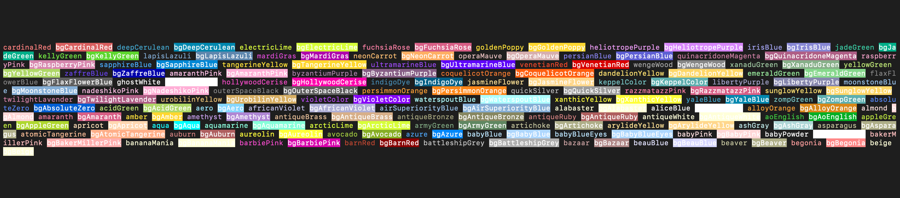

# Chalk-Pantone

Are your terminal colors feeling a bit... last century? Chalk-Pantone to the rescue! It's like a color bomb went off in your console—over 100 new Pantone colors for you to enjoy.

## The Color Revolution for Your Terminal

Chalk-Pantone extends Chalk to bring you a Pantone extravaganza. Go ahead, give your console output the makeover it deserves and turn those logs into a rainbow coalition.

### How to Unleash the Magic

Just import 'chalk-pantone' and let the color games begin. From "Sassy Pink" to "Brooding Burgundy," make each console message a work of art.

### See the Spectacle

Curious about how "Vibrant Orange" could brighten up your day? Check out these color samples and usage examples. It's like your terminal had a happy little accident with a Pantone chart.



Prepare for a spectrum overload. Your logs will never be the same.


And that's just the beginning. Once you've added Chalk-Pantone to your project, your terminal will be the hippest spot in your workspace.


Full List of Colours: 
```
    cardinalRed: '#C41E3A',
    deepCerulean: '#007BA7',
    electricLime: '#CCFF00',
    fuchsiaRose: '#C74375',
    goldenPoppy: '#FCC200',
    heliotropePurple: '#DF73FF',
    irisBlue: '#5A4FCF',
    jadeGreen: '#00A86B',
    kellyGreen: '#4CBB17',
    lapisLazuli: '#26619C',
    mardiGras: '#880085',
    neonCarrot: '#FFA343',
    operaMauve: '#B784A7',
    persianBlue: '#1C39BB',
    quinacridoneMagenta: '#8E3A59',
    raspberryPink: '#E25098',
    sapphireBlue: '#0F52BA',
    tangerineYellow: '#FFCC00',
    ultramarineBlue: '#3F00FF',
    venetianRed: '#C80815',
    wengeWood: '#645452',
    xanaduGreen: '#738678',
    yellowGreen: '#9ACD32',
    zaffreBlue: '#0014A8',
    amaranthPink: '#F19CBB',
    byzantiumPurple: '#702963',
    coquelicotOrange: '#FF3800',
    dandelionYellow: '#F0E130',
    emeraldGreen: '#50C878',
    flaxFlowerBlue: '#1C3B2B',
    ghostWhite: '#F8F8FF',
    hollywoodCerise: '#F400A1',
    indigoDye: '#00416A',
    jasmineFlower: '#F8DE7E',
    keppelColor: '#3AB09E',
    libertyPurple: '#545AA7',
    moonstoneBlue: '#73A9C2',
    nadeshikoPink: '#F6ADC6',
    outerSpaceBlack: '#414A4C',
    persimmonOrange: '#EC5800',
    quickSilver: '#A6A6A6',
    razzmatazzPink: '#E3256B',
    sunglowYellow: '#FFCC33',
    twilightLavender: '#8A496B',
    urobilinYellow: '#E1AD21',
    violetColor: '#7F00FF',
    waterspoutBlue: '#A4F4F9',
    xanthicYellow: '#EEED09',
    yaleBlue: '#0F4D92',
    zompGreen: '#39A78E',
    absoluteZero: '#0048BA',
    acidGreen: '#B0BF1A',
    aero: '#7CB9E8',
    africanViolet: '#B284BE',
    airSuperiorityBlue: '#72A0C1',
    alabaster: '#EDEAE0',
    aliceBlue: '#F0F8FF',
    alloyOrange: '#C46210',
    almond: '#EFDECD',
    amaranth: '#E52B50',
    amber: '#FFBF00',
    amethyst: '#9966CC',
    antiqueBrass: '#CD9575',
    antiqueBronze: '#665D1E',
    antiqueRuby: '#841B2D',
    antiqueWhite: '#FAEBD7',
    aoEnglish: '#008000',
    appleGreen: '#8DB600',
    apricot: '#FBCEB1',
    aqua: '#00FFFF',
    aquamarine: '#7FFFD4',
    arcticLime: '#D0FF14',
    armyGreen: '#4B5320',
    artichoke: '#8F9779',
    arylideYellow: '#E9D66B',
    ashGray: '#B2BEB5',
    asparagus: '#87A96B',
    atomicTangerine: '#FF9966',
    auburn: '#A52A2A',
    aureolin: '#FDEE00',
    avocado: '#568203',
    azure: '#007FFF',
    babyBlue: '#89CFF0',
    babyBlueEyes: '#A1CAF1',
    babyPink: '#F4C2C2',
    babyPowder: '#FEFEFA',
    bakerMillerPink: '#FF91AF',
    bananaMania: '#FAE7B5',
    barbiePink: '#DA1884',
    barnRed: '#7C0A02',
    battleshipGrey: '#848482',
    bazaar: '#98777B',
    beauBlue: '#BCD4E6',
    beaver: '#9F8170',
    begonia: '#FA6E79',
    beige: '#F5F5DC',```
