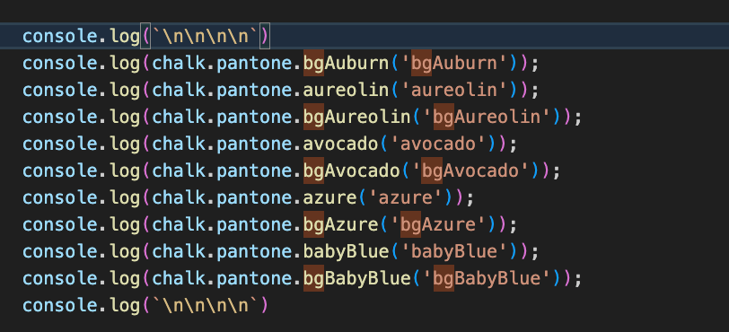

# Chalk-Pantone

## Pantone Colour Library Add-On for Chalk

This library introduces over 100 additional Pantone colours to your terminal, offering a vast palette for beautifying your console output. Elevate your terminal's aesthetics with the Chalk-Pantone library, bringing the rich and diverse Pantone color spectrum into your console applications.

### Usage

Begin by importing chalk from 'chalk-pantone'.

### Example Usage

Explore the potential of these Pantone colours in your terminal projects.

### Output Preview

Witness the transformation of your terminal with Chalk-Pantone's vibrant output.

