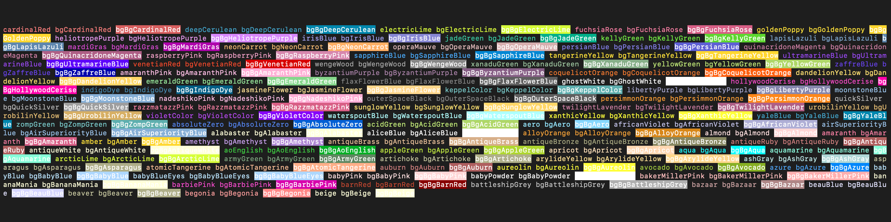
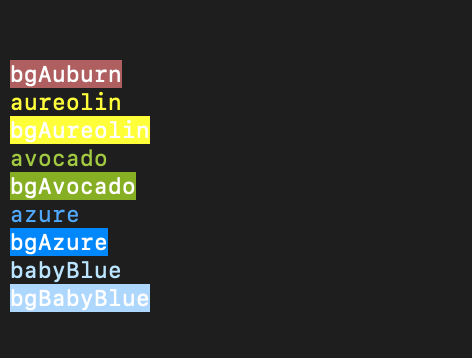

# Chalk-Pantone

Are your terminal colors feeling a bit... last century? Chalk-Pantone to the rescue! It's like a color bomb went off in your console—over 100 new Pantone colors for you to enjoy.

## The Color Revolution for Your Terminal

Chalk-Pantone extends Chalk to bring you a Pantone extravaganza. Go ahead, give your console output the makeover it deserves and turn those logs into a rainbow coalition.

### How to Unleash the Magic

Just import 'chalk-pantone' and let the color games begin. From "Sassy Pink" to "Brooding Burgundy," make each console message a work of art.

### See the Spectacle

Curious about how "Vibrant Orange" could brighten up your day? Check out these color samples and usage examples. It's like your terminal had a happy little accident with a Pantone chart.

Prepare for a spectrum overload. Your logs will never be the same.

And that's just the beginning. Once you've added Chalk-Pantone to your project, your terminal will be the hippest spot in your workspace.

